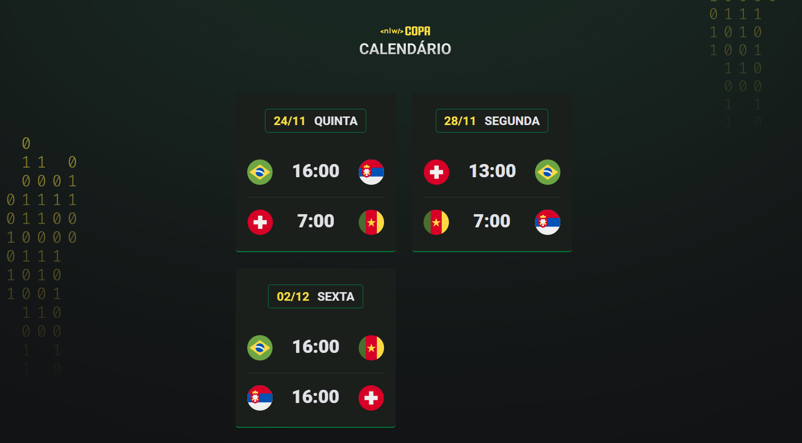

<h1 align="center"> NLW #10 Copa</h1>

  Evento exclusivo e gratuito, promovido pela Rocketseat para ensino de tecnologia WEB.

  <a href="##-tecnologias">Tecnologias</a>&nbsp;
  <a href="#-tecnologias">Projeto</a>&nbsp;
  <a href="#-tecnologias">Layout</a>&nbsp;
  <a href="#memo-licença">Licença</a>

  

 

  

## 🚀 Tecnologias

Esse projeto foi desenvolvido com as seguintes tecnologias:

- HTML e CSS
- JavaScript
- Git e Github

## 💻 Projeto

Nesse projeto foi desenvolvido um calendario de jogos da copa do mundo de 2022.

## 🔖 Layout

Você pode visualizar o layout do projeto através [DESSE LINK](https://www.figma.com/file/7xpXBWjfeM64dffb940vXb/Calend%C3%A1rio-de-Jogos-(Community)?node-id=175%3A1867). É necessário ter conta no [Figma](https://figma.com) para acessá-lo

